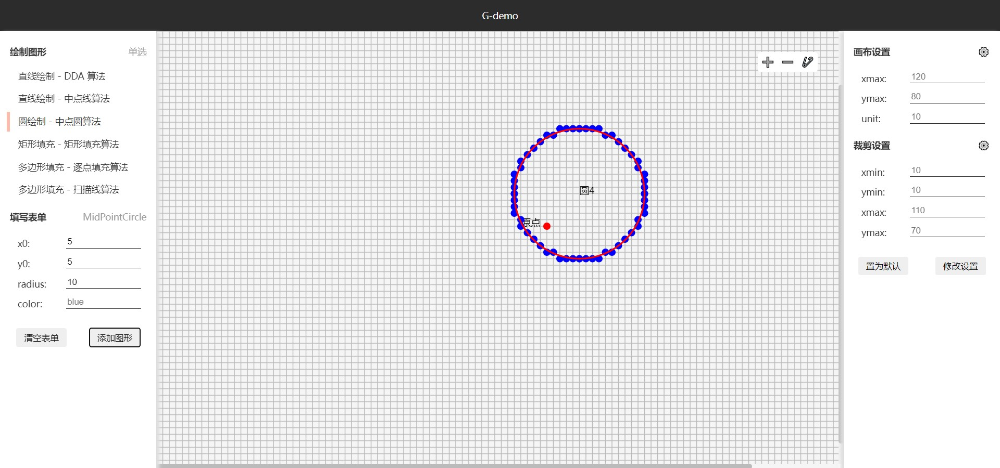

### 介绍
G-demo，计算机图形学的一个自研项目（not）

现在已经弃坑了，因为项目架构有问题，所以扩展不了东西

而且 web components 太难用了

### 预览

### 目录结构
- main 下是主页面
- components 目录下存放 web components 封装的组件
- graphics 下面存放图形绘制算法和图形对象

### 功能
选择扫描填充算法、填写参数，在 canvas 中绘制响应图形

静态页面，但是用了 es6 的 import 引入 js 文件 ，需要启动本地服务器才能正常运行，不然 js 文件引入错误

推荐用 webstorm 运行 main/index.html 或者用 vscode 的 live server 插件